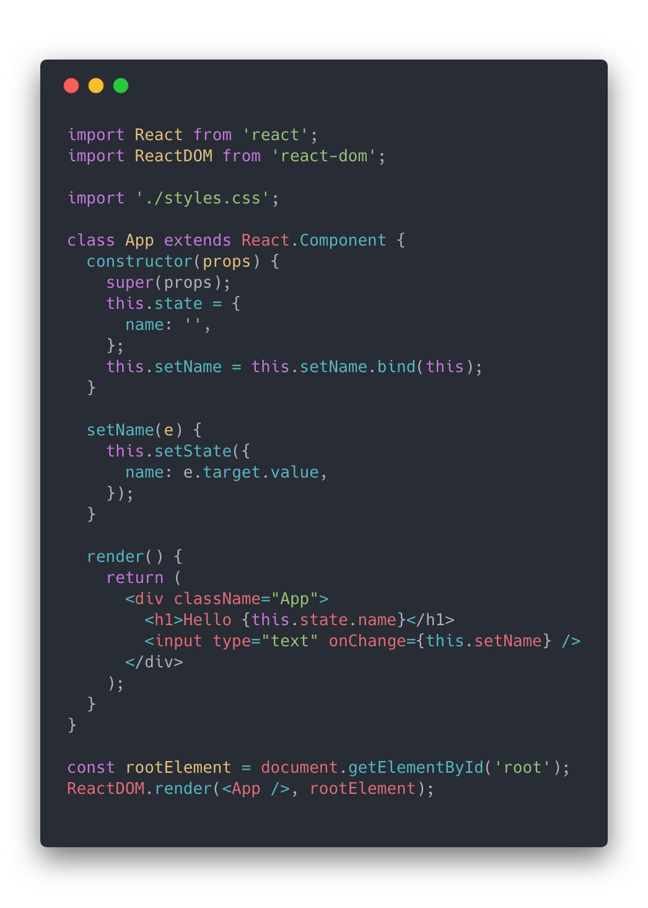

import { Split, FullScreenCode, Horizontal } from 'mdx-deck/layouts'
import { CodeSurfer } from "mdx-deck-code-surfer"
import nightOwl from "prism-react-renderer/themes/nightOwl"


<br />
<h2 style={{verticalAlign: 'middle'}}> ReactJS Fundamentals</h2>
<h3>By Lars Straathof</h3>
25-04-2019, Rijswijk

---

export default Split

## Agenda

<ul style={{textAlign: 'left'}}>
  <li>Prerequisites</li>
  <li>Intro</li>
  <li>React?</li>
  <li>What we are going to build</li>
  <li>Components</li>
  <li>Structure</li>
  <li>Libraries</li>
  <li>Lets start building</li>
  <li>Routing</li>
  <li>Testing</li>
  <li>Bonus</li>
  <li>Resources</li>
</ul>

---

## 1. Prerequisites

Clone git repository
```
  git clone https://github.com/lhstraathof/CoffeeManager_base.git .
```
Run npm install (or Yarn)
```
  npm install
```

---

export default Split

<div>
  <h2>2. Intro</h2>
</div>
<div style={{textAlign: 'left'}}>
  <h4>About me</h4>
  <h3>Lars Straathof</h3>
  <p><strong>Senior Front-end Developer</strong><br />
  QC Working @ ING</p>
  <small><a href="mailto:lstraathof@qualogy.com">lstraathof@qualogy.com</a></small><br />
  <small><a href="mailto:mail@lars.amsterdam">mail@lars.amsterdam</a></small>
</div>

---


---


---

export default Split

<div>
  <h5>2. Intro</h5>
  <h2>ECMASCRIPT 6 (ES6)</h2>
</div>
<div style={{textAlign: 'left'}}>
  <h4>Whats new?</h4>
  <ul>
    <li>Arrow functions</li>
    <li>Variable types</li>
    <li>Modules</li>
    <li>Classes</li>
    <li>Map, Filter, Reduce</li>
    <li>Destructuring</li>
    <li>Lots more</li>
  </ul>
</div>

---

<CodeSurfer
  title="Arrow functions"
  code={require("!raw-loader!./code/arrow.js")}
  lang="javascript"
  showNumbers={false}
  dark={false}
  steps={[
    { notes: ""},
    { range: [1, 5], notes: "ES5 Named Function" },
    { range: [7, 11], notes: "ES6 Arrow Function" },
  ]}
/>

---

<CodeSurfer
  title="Map and Spread"
  code={require("!raw-loader!./code/map_spread.js")}
  lang="javascript"
  showNumbers={false}
  dark={false}
  steps={[
    { notes: ""},
    { range: [14, 19], notes: "map over the data const" },
    { lines: [16], notes: "the three dots indicate the spread operator" },
    { lines: [17], notes: "Mutate count for newData" },
  ]}
/>

---

<CodeSurfer
  title="Modules"
  code={require("!raw-loader!./code/modules.js")}
  lang="javascript"
  showNumbers={false}
  dark={false}
  steps={[
    { notes: ""},
    { range: [1, 4], notes: "Create a module and export" },
    { range: [6, 9], notes: "Import module and run" },
  ]}
/>

---


# 3. React?


---

## React is a library for building user interfaces
It is not a framework

---

## Its all about the UI
- Composable modular Components
- No assumptions on tech-stack
- Not just web

---

### Virtual DOM


---

### More then web
- web
- app
- server

---

#### Examples


---


---


---

## What we are going to build?

---

### IT Coffee
<small>Your favorite beverage on demand</small><br /><br />


---

Manage your coffee and your co-workers, because no one likes to wait for there favorite beverage.

---

### Requirements:
- A person can only be chosen 1 time per round
- Be able to add/delete people

---

View live on:

[https://it-coffee.larsamsterdam.now.sh](https://it-coffee.larsamsterdam.now.sh)

---

## 5. Components

---

export default Split

<div>
  <h2>Think in blocks</h2>
  <h4>(and functionality)</h4>
</div>
<div>
  
</div>

---

## Our first component (a button)
* Create component
* Storybook
* JSX
* Props
* PropTypes
* Test

---

## Run Storybook

```
  npm run storybook
```

---

<CodeSurfer
  title="Button"
  code={require("!raw-loader!./code/button_base.js")}
  lang="javascript"
  showNumbers={false}
  dark={false}
  steps={[
    { notes: "Always start a component wiht react import"},
    { lines: [5], notes: "const name starts with a Capital" },
    { lines: [5], notes: "The props var is used to pass props to the component" },
    { lines: [7], notes: "Return the text property" },
  ]}
/>

---

## State management
* Classes vs functional Components

---

export default Split

<div>
  
</div>
<div>
  
</div>

---

<CodeSurfer
  title="useState"
  code={require("!raw-loader!./code/state_example.js")}
  lang="javascript"
  showNumbers={false}
  dark={false}
  steps={[
    { notes: ""},
    { lines: [1], notes: "Explicitly import useState" },
    { lines: [3], notes: "Create a new state holder" },
    { lines: [6], notes: "Conditionaly show text depending on the state" },
    { lines: [7], notes: "Trigger click event an dupdate state" },
  ]}
/>

---

## 6. Structure
* Component structure
* Project structure

---

<CodeSurfer
  title="Component structure"
  code={require("!raw-loader!../src/components/Hello/Hello.js")}
  lang="javascript"
  showNumbers={false}
  dark={false}
  steps={[
    { notes: ""},
    { lines: [4], notes: "Start custom element with capital" },
    { range: [8, 10], notes: "Check for correct prop types" },
    { range: [12, 14], notes: "Set default values for props" },
  ]}
/>

---

## 7. Libraries
* React Router
* Material UI
* Prop-types

---


## 8. Lets start building!
Create your own button component
- Dynamic text
- Dynamic color

---

## List
Create a list with people + delete button

---

## Add people
Form to add people

---

## Create Page
Setup a page for the created Components

---

## Handle data

---

## 9. Routing

---

## 10. Testing

---

## 11. Bonus
* Realtime database (Firebase)
* Deploy (Zeit NOW)

---

export default Split

<div>
  <h2>Sources</h2>
</div>
<div style={{fontSize: '12px !important'}}>
  <a href="https://reactjs.org/docs/getting-started.html">React docs</a><br />
  <a href="https://facebook.github.io/create-react-app/">Create React App</a><br />
  <a href="https://reacttraining.com/react-router/web/guides/quick-start">React Router</a><br />
  <a href="https://jestjs.io/">Jest IO</a><br />
  <a href="https://material-ui.com">Material UI</a><br />
  <a href="https://storybook.js.org/">Storybook</a><br />
  <a href="https://zeit.co/now">Zeit NOW</a><br />
  <a href="https://firebase.google.com/">Firebase</a><br />
  <a href="https://github.com/jxnblk/mdx-deck">MDX Deck</a>
</div>

---

## Learn more?
Tip: Look at the [React Developer Roadmap 2019](https://github.com/adam-golab/react-developer-roadmap)

---

## Questions?

---

## Feedback
What did you think of the workshop?

Please fill in [this short form](https://forms.gle/JJLAjwqbViYFkisq8)

---

## Thank you!
Let's make great things together